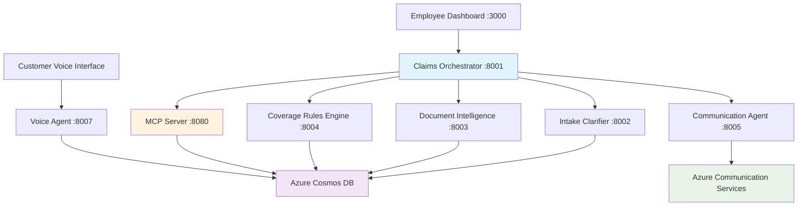

# 🏥 Zava Insurance — Multi-Agent AI Claims Processing

A modern, intelligent insurance claims processing platform built with **Azure AI Foundry**, **Agent-to-Agent (A2A) Protocol**, and **Model Context Protocol (MCP)** for automated claims validation, document processing, and coverage evaluation.

## 🚀 Overview

This system revolutionizes insurance claims processing through **intelligent agent orchestration**, providing:

- **🎤 Real-time Voice Interface** for customer claim status queries
- **🤖 AI-powered multi-agent orchestration** with dynamic routing
- **📄 Document Intelligence** for claim document extraction
- **🛡️ Smart Coverage Rules Engine** for policy evaluation
- **📱 Professional Dashboard** for claims processing employees
- **📧 Automated Notifications** via Azure Communication Services

## 🏗️ Architecture



## 🛠️ Technology Stack

| Category | Technology | Purpose |
|----------|------------|---------|
| **AI Framework** | Azure AI Foundry | Agent orchestration and intelligent routing |
| **Communication** | A2A Protocol | Agent-to-agent communication |
| **Database** | Azure Cosmos DB + MCP | Scalable data storage with protocol standardization |
| **Voice** | Azure Voice Live API | Real-time voice interactions |
| **Document Processing** | Azure Document Intelligence | PDF analysis and data extraction |
| **Web Framework** | FastAPI + WebSocket | High-performance APIs and real-time communication |
| **Agent Framework** | Semantic Kernel | AI agent creation and management |
| **Notifications** | Azure Communication Services | Email delivery |

## 📊 System Components

| Agent | Port | Purpose |
|-------|------|---------|
| **Claims Orchestrator** | 8001 | Main coordination — routes claims through pipeline |
| **Intake Clarifier** | 8002 | Data validation and consistency checks |
| **Document Intelligence** | 8003 | PDF text extraction, OCR, structured data |
| **Coverage Rules Engine** | 8004 | Policy limit validation and benefit calculation |
| **Communication Agent** | 8005 | Email notifications via Azure Communication Services |
| **Voice Agent** | 8007 | Real-time voice interface for customers |
| **MCP Server** | 8080 | Cosmos DB operations via MCP protocol |
| **Dashboard** | 3000 | Employee claims dashboard and agent registry |

## 🚀 Quick Start

### Prerequisites
- Python 3.11+
- Azure subscription with AI services
- Azure Cosmos DB account

### 1. Clone & Setup
```bash
git clone https://github.com/jeraldmsft/zava-insurance-claims-agents.git
cd zava-insurance-claims-agents

python -m venv .venv
.venv\Scripts\activate        # Windows
# source .venv/bin/activate   # Linux/Mac

pip install -r requirements.txt
```

### 2. Configure Environment
```bash
# Copy all .env files
cp .env.example .env
cp insurance_agents\.env.example insurance_agents\.env
cp insurance_agents\agents\claims_orchestrator\.env.example insurance_agents\agents\claims_orchestrator\.env
cp azure-cosmos-mcp-server\python\.env.example azure-cosmos-mcp-server\python\.env
```

Edit each `.env` file with your Azure credentials (Cosmos DB, OpenAI, Document Intelligence, Communication Services).

### 3. Create Azure Resources

| Resource | Purpose |
|----------|---------|
| Azure Cosmos DB | Claims data storage (database: `insurance`, containers: `claim_details`, `extracted_patient_data`) |
| Azure OpenAI Service | GPT-4o model deployment |
| Azure AI Foundry | Agent orchestration workspace |
| Azure Document Intelligence | PDF document processing |
| Azure Communication Services | Email notifications |
| Azure Voice Live API | Real-time voice (optional) |

### 4. Load Sample Data
Import the JSON files from `database_samples/cosmosdb/claim_details/` into your Cosmos DB `claim_details` container.

### 5. Start the System

```bash
# Terminal 1: MCP Server
cd azure-cosmos-mcp-server/python && python cosmos_server.py

# Terminal 2-6: Core Agents
cd insurance_agents
python -m agents.claims_orchestrator
python -m agents.intake_clarifier
python -m agents.document_intelligence_agent
python -m agents.coverage_rules_engine
python -m agents.communication_agent

# Terminal 7: Voice Agent
cd insurance_agents/agents/client_live_voice_agent && python fastapi_server.py

# Terminal 8: Dashboard
cd insurance_agents/insurance_agents_registry_dashboard && python app.py
```

### 6. Access
- **Claims Dashboard**: http://localhost:3000
- **Agent Registry**: http://localhost:3000/static/agent_registry.html
- **Voice Interface**: http://localhost:8007
- **Agent Cards**: http://localhost:{port}/.well-known/agent.json

## 📱 Usage

### Employee Workflow (Dashboard)
```
Type: "Process claim IP-01"
→ Orchestrator fetches claim from Cosmos DB via MCP
→ Routes to Document Intelligence → Intake Clarifier → Coverage Rules → Communication
→ Results displayed in chat with full audit trail
```

### Customer Voice (Voice Agent)
```
Speak: "What is the status of claim IP-01?"
→ Voice agent queries Cosmos DB
→ Responds with claim details via voice
→ Supports barge-in (interrupt while agent is speaking)
```

## 📁 Project Structure
```
zava-insurance-claims-agents/
├── azure-cosmos-mcp-server/     # MCP server for Cosmos DB
│   ├── python/cosmos_server.py  # FastMCP server with CRUD tools
│   └── dataset/                 # Sample claims data
├── insurance_agents/
│   ├── agents/
│   │   ├── claims_orchestrator/ # Main orchestration agent
│   │   ├── intake_clarifier/    # Data validation agent
│   │   ├── document_intelligence_agent/  # PDF processing
│   │   ├── coverage_rules_engine/        # Policy evaluation
│   │   ├── communication_agent/          # Email notifications
│   │   └── client_live_voice_agent/      # Voice interface
│   ├── shared/                  # Shared utilities
│   │   ├── base_agent.py        # Base A2A agent class
│   │   ├── a2a_client.py        # Agent-to-agent client
│   │   ├── cosmos_db_client.py  # Cosmos DB operations
│   │   └── mcp_chat_client.py   # MCP protocol client
│   └── insurance_agents_registry_dashboard/  # Employee UI
├── database_samples/            # Sample Cosmos DB documents
├── requirements.txt
└── .env.example
```

## 🔒 Security Notes
- Never commit `.env` or `config.js` files (they contain credentials)
- All sensitive files are listed in `.gitignore`
- This project is for **demo/non-production use only**

## 🙏 Acknowledgments
- Inspired by [ujjwalmsft/insuranceA2AMCP](https://github.com/ujjwalmsft/insuranceA2AMCP)
- **Azure AI Platform** for robust AI services
- **A2A Protocol** for agent communication standards
- **Model Context Protocol (MCP)** for database interaction standardization

---
**⚠️ Disclaimer:** This project is for demonstration purposes only. Do not use in a production environment.
